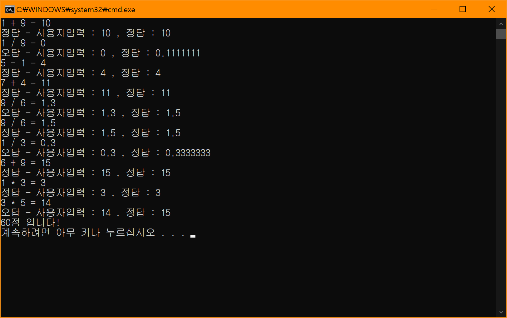

# BIT_EXPERT_CS_MathExamConsole
C# : 사칙연산 프로그램

## 개요
* 비트 고급과정 - C# 중간과제 : 추상화를 이용한 사칙연산 콘솔 프로그램
* 수학문제는 피연산자가 2개인 사칙연산으로 구성되어 있다.
* 사칙연산에서 공통으로 갖는 계산, 채점 기능은 추상화한다.
* 출제문제 수는 총 10문제로 하며 각 문제는 임의의 사칙연산자와 피연산자가 출제되어야한다.
* 문제를 맞혔을 경우 10점씩 가산하여 총점 100점으로한다.
* 문제를 모두 풀었을 경우 결과 점수를 콘솔에 출력한다.
* 문제를 생성하고 풀고 결과를 출력하는 기능은 별도의 컨트롤러 클래스로 정의한다.

## 개발 기간
* 2017.04.17

## 기술 스택
* C#

## 개발 환경
* OS : Windows 8.1
* IDE : Visul Studio 2017
* .NET Framework 4.5.2

## 실행 화면  

## 실행 방법
1. 솔루션을 열고 빌드
2. 빌드된 프로그램 실행
3. 콘솔에 표시된 문제를 풀어 콘솔에 입력 (10회)

## API 참조
* List<T> : <https://docs.microsoft.com/ko-kr/dotnet/api/system.collections.generic.list-1?view=netframework-4.5.2>
* C# 기본 제공 참조 형식 - 대리자 형식 : <https://docs.microsoft.com/ko-kr/dotnet/csharp/language-reference/builtin-types/reference-types#the-delegate-type>
* 대리자 : <https://docs.microsoft.com/ko-kr/dotnet/csharp/programming-guide/delegates/>
* abstract : <https://docs.microsoft.com/ko-kr/dotnet/csharp/language-reference/keywords/abstract>