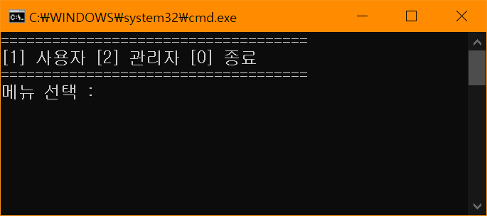
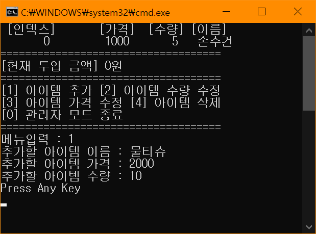
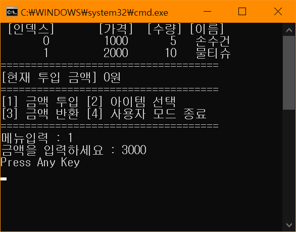
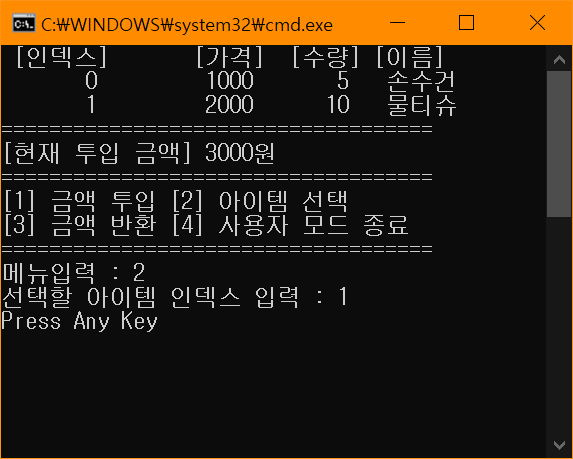

# BIT_EXPERTCS_VendingConsole
C# : 컬렉션을 이용한 자판기 프로그램

## 개요
* 비트 고급과정 - C# : 컬렉션을 이용한 자판기 프로그램
* 자판기는 사용자와 관리자가 사용
* 자판기는 클래스로 정의하며 상품컬렉션, 투입금액을 속성으로 갖는다
* 상품은 클래스로 정의하며 상품명, 가격, 수량을 속성으로 갖는다
* 사용자는 금액투입 및 반환, 상품 선택 동작을 한다
* 관리자는 상품의 생성, 수량이나 가격 수정, 삭제 동작을 한다
* 사용자와 관리자는 동작을 선택하는 메뉴를 출력하는 PrintMenu()를 구현한다.
* 사용자와 관리자는 동작을 반복하거나 복귀하는 Run()을 구현한다.

## 개발 기간
* 2017.04.12

## 기술 스택
* C#

## 참여도
* 사용자와 관리자의 메뉴출력 부분 구현

## 개발 환경
* OS : Windows 8.1
* IDE : Visul Studio 2017
* .NET Framework 4.5.2

## 실행 화면
* 초기 화면  

* 관리자 - 상품추가 화면  

* 사용자 - 금액투입 화면  

* 사용자 - 상품선택 화면  

## 실행 방법
1. 솔루션을 열고 빌드
2. 빌드된 프로그램 실행
3. 처음표시되는 메뉴에서 키보드'2'키를 눌러 관리자로 진입
4. 키보드'1'키를 눌러 아이템 추가
5. 처음표시되는 메뉴에서 키보드'1'키를 눌러 사용자로 진입
6. 키보드'1'키를 눌러 금액투입
7. 사용자 메뉴에서 키보드'2'키를 눌러 상품 선택 모드로 진입
8. 관리자 메뉴에서 추가했던 상품의 인덱스 입력
9. 투입 금액 차감과 선택한 상품의 수량 감소 확인

## API 참조
* List<T> : <https://docs.microsoft.com/ko-kr/dotnet/api/system.collections.generic.list-1?view=netframework-4.5.2>
* List<T>.Add(T) : <https://docs.microsoft.com/ko-kr/dotnet/api/system.collections.generic.list-1.add?view=netframework-4.5.2>
* List<T>.RemoveAt(Int32) : <https://docs.microsoft.com/ko-kr/dotnet/api/system.collections.generic.list-1.removeat?view=netframework-4.5.2>