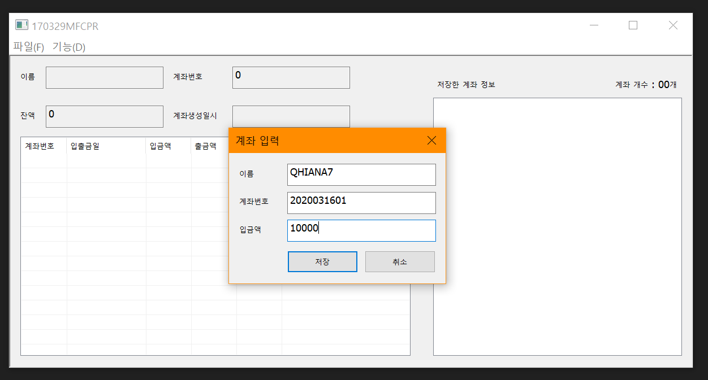
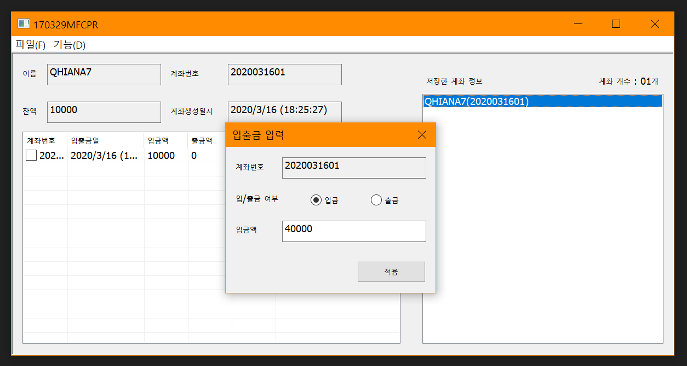
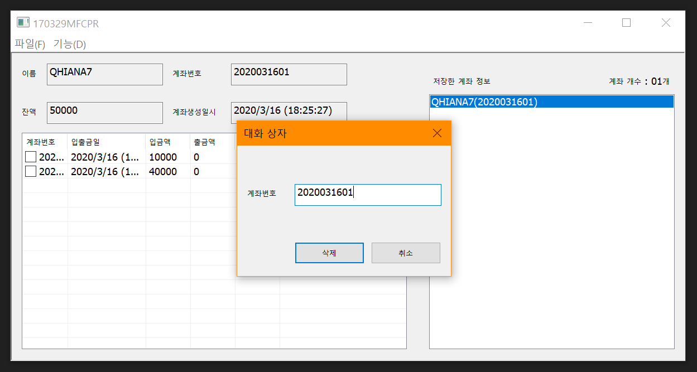

# BIT_EXPERT_MFC_AccountManager
MFC : 파일IO, 모달 대화상자를 이용한 계좌관리 프로그램

## 개요
* 비트 고급과정 - MFC : 모달 대화상자 리소스를 만들고 모달 대화상자에서 발생하는 메시지를 처리하도록 합니다.
* 계좌 개설, 삭제 대화상자는 모달 대화상자, 입출금은 모달리스 대화상자로 구현한다.
* 계좌는 여러개 생성이 가능하도록 하며 입출금 대화상자에서 기능사용시 부모 대화상자에서 실시간으로 반영되도록 한다.
* 계좌삭제는 삭제할 계좌번호를 입력받아서 해당 계좌번호를 삭제하며 모든 입출금내역을 삭제한다.
* 계좌정보와 계좌입출금 내역은 직렬화된 이진파일로 저장하고 이후 프로그램 재기동시 데이터가 유지하도록 한다.

## 개발 기간
* 2017.03.29

## 기술 스택
* C++, MFC

## 개발 환경
* OS : Windows 8.1
* IDE : Visul Studio 2017

## 실행 화면
* 계좌개설 화면  

* 입출금 화면  

* 계좌삭제 화면  

## 실행 방법
1. 솔루션을 열고 'F7'을 눌러 빌드
2. 'Ctrl + F5'를 눌러 디버깅하지 않고 실행
3. [기능(D)] - [입력...]메뉴를 클릭하고 대화상자를 열어 계좌번호, 이름, 초기입금액을 입력하고 [저장]버튼을 누릅니다.
4. 우측 [저장한 계좌 정보]리스트박스에서 입출금할 계좌를 선택하고 [기능(D)] - [입출금]메뉴를 클릭하여 입출금을 수행합니다.
5. 아래 입출금내역에 입출금했던 내용이 표시되는지 확인합니다.
6. 프로그램 종료 후 재기동하여 계좌정보와 계좌입출금내역이 보존되어있는지 확인합니다.
7. [기능(D)] - [삭제]메뉴를 클릭하고 대화상자를 열어 계좌번호를 입력하고 [삭제]버튼을 누릅니다.

## API 참조
* CDialog::DoModal : <https://docs.microsoft.com/ko-kr/cpp/mfc/reference/cdialog-class?view=vs-2019#domodal>
* CDialog::Create : <https://docs.microsoft.com/ko-kr/cpp/mfc/reference/cdialog-class?view=vs-2019#create>
* CFile::Open : <https://docs.microsoft.com/ko-kr/cpp/mfc/reference/cfile-class?view=vs-2019#open>
* CArchive::CArchive : <https://docs.microsoft.com/ko-kr/cpp/mfc/reference/carchive-class?view=vs-2019#carchive>
* CArchive::operator >> : <https://docs.microsoft.com/ko-kr/cpp/mfc/reference/carchive-class?view=vs-2019#operator_gt_gt>
