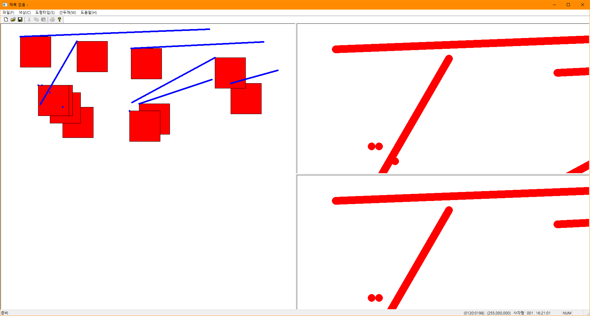

# BIT_EXPERT_MFC_Basic_Practice
MFC : 컨트롤 제어, 마우스 이벤트, 메뉴 처리기, 그리기 실습

## 개요
* 비트 고급과정 - MFC : 기본 기능 실습
* 클라이언트 영역을 분할자를 이용하여 정적 분할 창을 만들 수 있습니다.
* MFC에서는 하나의 Document와 여러개의 View로 구성될 수 있어 분할 창마다 View를 별개로 정의할 수 있습니다.
* 사용자 정의 View(이 프로젝트에서 PaneView)에서 Document에 저장된 선 좌표 정보를 가져와 2배로 확대하여 그릴 수 있습니다.
* 메뉴 리소스 만들어 컨텍스트 메뉴, 트레이아이콘 메뉴로 등록할 수 있습니다.
* 마우스 왼쪽 클릭한 지점에 도형을 그릴 수 있습니다.
* 마우스 이벤트를 이용해 선을 그릴 수 있습니다.

## 개발 기간
* 2017.03.28

## 기술 스택
* C++, MFC

## 개발 환경
* OS : Windows 8.1
* IDE : Visul Studio 2017

## 실행 화면

## 실행 방법
1. 솔루션을 열고 'F7'을 눌러 빌드
2. 'Ctrl + F5'를 눌러 디버깅하지 않고 실행
3. 왼쪽 분할 창에서 마우스 왼쪽 클릭을 하면 도형을 그립니다.
4. [색상],[도형타입],[선두깨]를 사용하여 그릴 도형을 재정의합니다.
5. 왼쪽 분할 창에서 마우스 왼쪽 버튼을 눌러 드래그 학고 놓으면 선을 그리며 오른쪽 두개의 분할 창에 2배로 확대하여 그립니다.

## API 참조
* CSplitterWnd::CreateStatic : <https://docs.microsoft.com/ko-kr/cpp/mfc/reference/csplitterwnd-class?view=vs-2019#createstatic>
* CSplitterWnd::CreateView : <https://docs.microsoft.com/ko-kr/cpp/mfc/reference/csplitterwnd-class?view=vs-2019#createview>
* CMenu::LoadMenu : <https://docs.microsoft.com/ko-kr/cpp/mfc/reference/cmenu-class?view=vs-2019#loadmenu>
* CMenu::TrackPopupMenu : <https://docs.microsoft.com/ko-kr/cpp/mfc/reference/cmenu-class?view=vs-2019#trackpopupmenu>
* CWnd::Invalidate : <https://docs.microsoft.com/ko-kr/cpp/mfc/reference/cwnd-class?view=vs-2019#invalidate>
* CWnd::InvalidateRect : <https://docs.microsoft.com/ko-kr/cpp/mfc/reference/cwnd-class?view=vs-2019#invalidaterect>
* CWnd::SetCapture : <https://docs.microsoft.com/ko-kr/cpp/mfc/reference/cwnd-class?view=vs-2019#setcapture>
* CWnd::GetCapture : <https://docs.microsoft.com/ko-kr/cpp/mfc/reference/cwnd-class?view=vs-2019#getcapture>