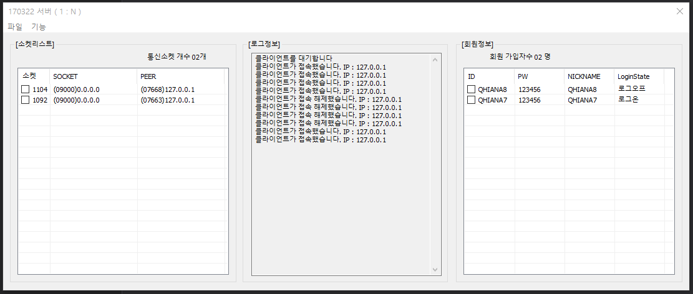
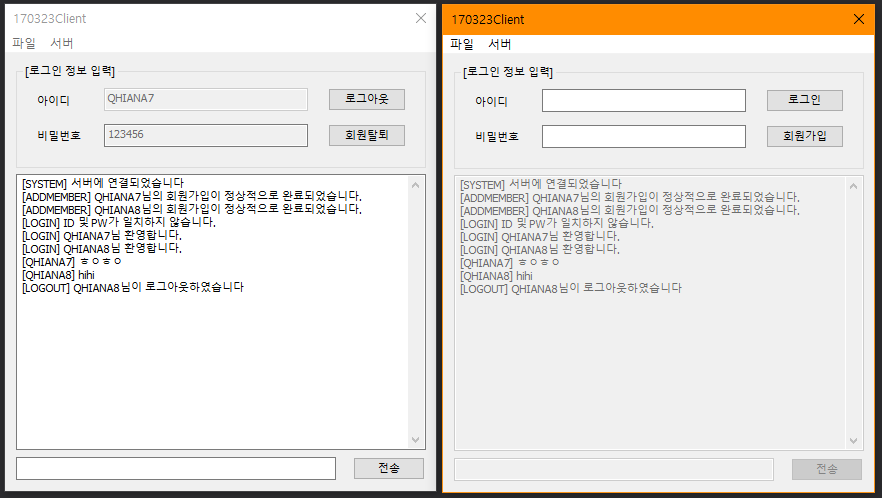
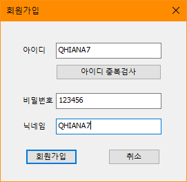

# BIT_EXPERT_WNP_MultiEcho_Practice2
Windows Network Programming : Socket과 스레드를 이용한 다중 에코 실습2

## 개요
* 비트 고급과정 - Windows Network Programming : [BIT_EXPERT_WNP_MultiEcho_Practice](https://github.com/QHIANA7/BIT_EXPERT_WNP_MultiEcho_Practice) 프로젝트와 [BIT_EXPERT_WSP_MemberManager](https://github.com/QHIANA7/BIT_EXPERT_WSP_MemberManager) 프로젝트의 기능을 결합한 프로젝트
* 서버 프로그램은 포트를 임의로 변경할 수 있고 클라이언트 프로그램의 접속을 대기할 수 있습니다.
* 클라이언트 프로그램은 서버의 IP, Port를 입력하여 서버에 접속할 수 있습니다.
* 클라이언트에서 회원가입이 가능하며 회원정보는 서버에서 관리됩니다.
* 클라이언트 프로그램은 서버에 메시지를 전송할 수 있고 서버 프로그램은 접속된 모든 클라이언트 프로그램에 다시 전송합니다.

## 개발 기간
* 2017.03.23

## 기술 스택
* C++, Win32 API

## 개발 환경
* OS : Windows 8.1
* IDE : Visul Studio 2017

## 실행 화면
* 서버 화면  

* 클라이언트 화면  

* 회원가입 화면  

## 실행 방법
1. 솔루션을 열고 'F7'을 눌러 빌드
2. 빌드된 서버와 클라이언트 프로그램을 모두 실행
3. 서버 프로그램의 [기능] - [서버실행...] 메뉴를 선택하고 대화상자에서 포트를 입력하고 '실행' 버튼을 클릭합니다.
4. 클라이언트 프로그램에서 [서버] - [서버 설정...] 메뉴를 선택하고 대화상자에서 서버 정보를 입력하고 '적용' 버튼을 눌러 서버에 연결합니다.
5. [로그인 정보 입력] 그룹박스에서 '회원가입' 버튼을 누르고 대화상자에서 회원정보를 입력하고 '회원가입' 버튼을 눌러 서버에 회원가입 데이터를 전송합니다.
6. [로그인 정보 입력] 그룹박스에 회원정보를 입력하고 '로그인' 버튼을 클릭합니다.
7. 클라이언트 프로그램 하단의 텍스트 박스에 메시지를 입력하고 '전송' 버튼을 눌러 서버에 전송하고 서버로부터 에코를 받습니다.

## API 참조
* CreateThread : <https://docs.microsoft.com/ko-kr/windows/win32/api/processthreadsapi/nf-processthreadsapi-createthread>
* WSAStartup : <https://docs.microsoft.com/ko-kr/windows/win32/api/winsock2/nf-winsock2-wsastartup>
* WSACleanup : <https://docs.microsoft.com/ko-kr/windows/win32/api/winsock2/nf-winsock2-wsacleanup>
* socket : <https://docs.microsoft.com/ko-kr/windows/win32/api/winsock2/nf-winsock2-socket>
* closesocket : <https://docs.microsoft.com/ko-kr/windows/win32/api/winsock2/nf-winsock2-closesocket>
* htons : <https://docs.microsoft.com/ko-kr/windows/win32/api/winsock2/nf-winsock2-htons>
* ntohs : <https://docs.microsoft.com/ko-kr/windows/win32/api/winsock2/nf-winsock2-ntohs>
* accept : <https://docs.microsoft.com/ko-kr/windows/win32/api/winsock2/nf-winsock2-accept>
* bind : <https://docs.microsoft.com/ko-kr/windows/win32/api/winsock2/nf-winsock2-bind>
* listen : <https://docs.microsoft.com/ko-kr/windows/win32/api/winsock2/nf-winsock2-listen>
* recv : <https://docs.microsoft.com/ko-kr/windows/win32/api/winsock2/nf-winsock2-recv>
* send : <https://docs.microsoft.com/ko-kr/windows/win32/api/winsock2/nf-winsock2-send>
* getsockname : <https://docs.microsoft.com/ko-kr/windows/win32/api/winsock2/nf-winsock2-getsockname>
* getpeername : <https://docs.microsoft.com/ko-kr/windows/win32/api/winsock2/nf-winsock2-getpeername>
* InetNtcp : <https://docs.microsoft.com/ko-kr/windows/win32/api/ws2tcpip/nf-ws2tcpip-inetntopw>