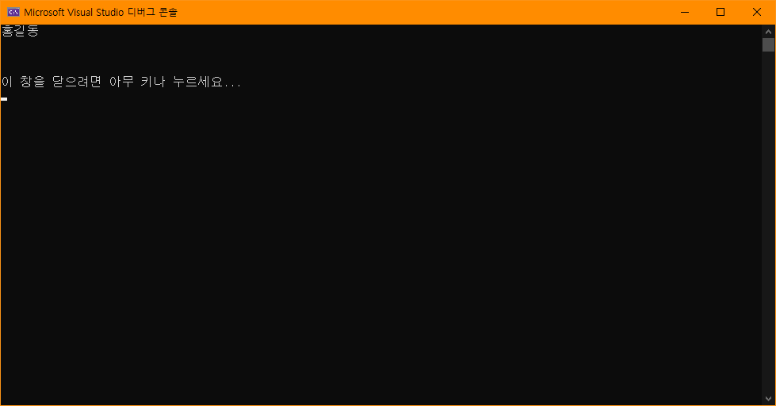

# BIT_EXPERT_WSP_DLL_Practice
Windows System Programming : DLL을 빌드하고 Import하여 사용하는 실습

## 개요
* 비트 고급과정 - Windows System Programming : 임의의 메시지를 Get, Set 할 수 있는 DLL을 빌드하고 다른 프로젝트에서 참조하여 사용해보는 실습

## 개발 기간
* 2017.03.20

## 기술 스택
* C++, Win32 API

## 개발 환경
* OS : Windows 8.1
* IDE : Visul Studio 2017

## 실행 화면

## 실행 방법
1. 솔루션을 열고 'F7'을 눌러 빌드
2. Ctrl + F5를 눌러 디버깅하지않고 실행

## API 참조
* EXTERN_C : <https://docs.microsoft.com/en-us/previous-versions//ms692683(v=vs.85)>
* __declspec : <https://docs.microsoft.com/ko-kr/cpp/cpp/declspec?view=vs-2019>
* dllexport : <https://docs.microsoft.com/ko-kr/cpp/cpp/dllexport-dllimport?view=vs-2019>
* dllimport : <https://docs.microsoft.com/ko-kr/cpp/cpp/dllexport-dllimport?view=vs-2019>
