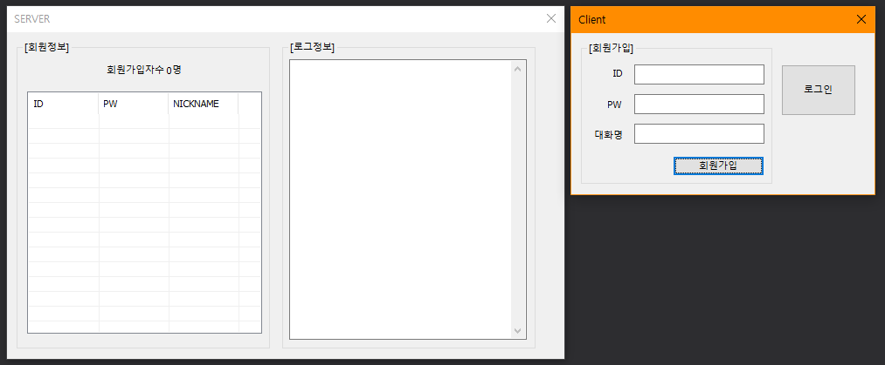

# BIT_EXPERT_WSP_MemberManager
Windows System Programming : IPC 기법중 하나인 WM_COPYDATA를 이용한 회원관리 프로그램

## 개요
* 비트 고급과정 - Windows System Programming : WM_COPYDATA 메시지를 이용하여 프로세스간 통신을 구현합니다.
* 클라이언트에서 회원가입, 로그인, 로그아웃, 회원탈퇴를 요청하여 서버에서 처리하여 응답을 리턴하는 구조입니다.
* 서버는 클라이언트에서 보낸메시지에 대한 로그를 기록합니다.
* 서버는 회원가입된 목록을 리스트박스에 표시합니다. 리스트박스에는 ID, PW, 닉네임을 표시합니다.

## 개발 기간
* 2017.03.16

## 기술 스택
* C++, Win32 API

## 개발 환경
* OS : Windows 8.1
* IDE : Visul Studio 2017

## 실행 화면
* 초기화면  

* 회원가입 화면

* 로그인 화면

* 로그아웃 화면

* 회원탈퇴 화면

## 실행 방법
1. 솔루션을 열고 'F7'을 눌러 빌드
2. 빌드된 서버와 클라이언트 프로그램을 모두 실행
3. 아래에서 수행하는 모든 동작이 서버 프로그램에서 로그에 기록되고 회원 목록에 변화가 있는지 살펴봅니다.
4. 클라이언트 프로그램에서 ID, PW, 닉네임을 입력하고 '회원가입' 버튼을 눌러 서버로 메시지를 송신합니다.
5. 클라이언트 프로그램에서 ID, PW를 입력하고 '로그인' 버튼을 눌러 서버로 메시지를 송신합니다.
6. 클라이언트 프로그램에서 '로그아웃' 버튼을 눌러 서버로 메시지를 송신합니다.
7. 클라이언트 프로그램에서 로그인 상태로 만들고 '회원탈퇴' 버튼을 눌러 서버로 메시지를 송신합니다.

## API 참조
* COPYDATASTRUCT : <https://docs.microsoft.com/ko-kr/windows/win32/api/winuser/ns-winuser-copydatastruct>
* WM_COPYDATA : <https://docs.microsoft.com/ko-kr/windows/win32/dataxchg/wm-copydata>
* SendMessage : <https://docs.microsoft.com/ko-kr/windows/win32/api/winuser/nf-winuser-sendmessage>
