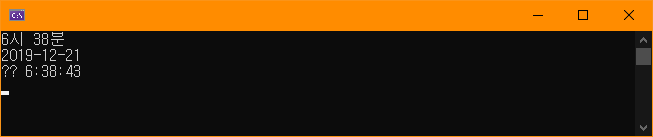

# BIT_EXPERT_WSP_NamedPipe_Practice
Windows System Programming : IPC 기법중 하나인 NamedPipe를 이용한 데이터 송수신 프로그램

## 개요
* 비트 고급과정 - Windows System Programming : NamedPipe를 이용하여 프로세스간 통신을 구현합니다.
* 서버에서 명명된 파이프를 입출력 모드로 오픈하고 클라이언트는 읽기쓰기 모드로 접근합니다.
* 서버는 오직 1개의 인스턴스만 만들도록 합니다.
* 서버는 클라이언트에 현재 날짜에 대한 구조체 데이터를 전달하고 클라이언트의 응답을 받으면 다음 접속을 대기합니다.
* 클라이언트는 서버에서 보낸 구조체 데이터를 로컬언어에 맞는 데이터로 출력하고 서버에 성공메시지를 보냅니다.

## 개발 기간
* 2017.03.17

## 기술 스택
* C++, Win32 API

## 개발 환경
* OS : Windows 10 (1903) 
* IDE : Visul Studio 2019

## 실행 화면
* 서버 화면  

* 클라이언트 화면  

## 실행 방법
1. 솔루션을 열고 'F7'을 눌러 빌드
2. 서버를 먼저 실행하고 클라이언트를 실행
3. 클라이언트 프로그램에서 서버에서 보낸 시간 구조체를 콘솔에 출력합니다.
4. 서버 콘솔에서 클라이언트로부터의 성공메시지를 수신받아 출력합니다.

## API 참조
* CreateNamedPipe : <https://docs.microsoft.com/ko-kr/windows/win32/api/winbase/nf-winbase-createnamedpipea>
* CreateFile : <https://docs.microsoft.com/ko-kr/windows/win32/api/fileapi/nf-fileapi-createfilew>
* ConnectNamedPipe : <https://docs.microsoft.com/ko-kr/windows/win32/api/namedpipeapi/nf-namedpipeapi-connectnamedpipe>
* DisconnectNamedPipe : <https://docs.microsoft.com/ko-kr/windows/win32/api/namedpipeapi/nf-namedpipeapi-disconnectnamedpipe>
* FlushFileBuffers : <https://docs.microsoft.com/ko-kr/windows/win32/api/fileapi/nf-fileapi-flushfilebuffers>
* GetSystemTime : <https://docs.microsoft.com/ko-kr/windows/win32/api/sysinfoapi/nf-sysinfoapi-getsystemtime>
* ReadFile : <https://docs.microsoft.com/ko-kr/windows/win32/api/fileapi/nf-fileapi-readfile>
* SetLocalTime : <https://docs.microsoft.com/ko-kr/windows/win32/api/sysinfoapi/nf-sysinfoapi-setlocaltime>
* SystemTimeToTzSpecificLocalTime : <https://docs.microsoft.com/ko-kr/windows/win32/api/timezoneapi/nf-timezoneapi-systemtimetotzspecificlocaltime>
* WriteFile : <https://docs.microsoft.com/ko-kr/windows/win32/api/fileapi/nf-fileapi-writefile>
