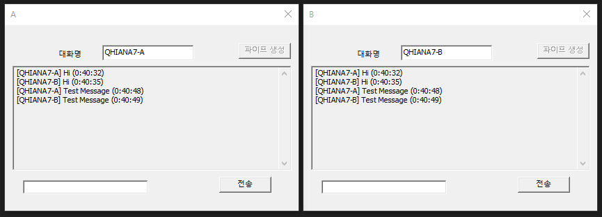

# BIT_EXPERT_WSP_PipeChat
* Windows System Programming : 익명 파이프 통신을 이용한 채팅 프로그램

## 개요
* Win32 API에서 제공하는 파이프를 이용하여 문자열을 주고받는 기능을 구현

## 개발 목적
* 비트 고급과정 - Windows System Programming : 익명 파이프 통신사용 예제

## 개발 기간
* 2017.03.17

## 기술 스택
* C++, Win32 API

## 개발 환경
* OS : Windows 8.1
* IDE : Visul Studio 2017

## 실행 화면

## 실행 방법
1. 솔루션을 열고 'F7'을 눌러 빌드
2. 빌드된 프로그램 2개 모두 실행
3. 2개 프로그램 모두 '파이프 생성' 버튼 클릭
4. 프로그램 하단의 텍스트 박스에 문자열 입력 후 '전송' 버튼 클릭

## API 참조
* CreatePipe : <https://docs.microsoft.com/ko-kr/windows/win32/api/namedpipeapi/nf-namedpipeapi-createpipe/>
* ReadFile : <https://docs.microsoft.com/ko-kr/windows/win32/api/fileapi/nf-fileapi-readfile/>
* WriteFile : <https://docs.microsoft.com/ko-kr/windows/win32/api/fileapi/nf-fileapi-writefile/>
