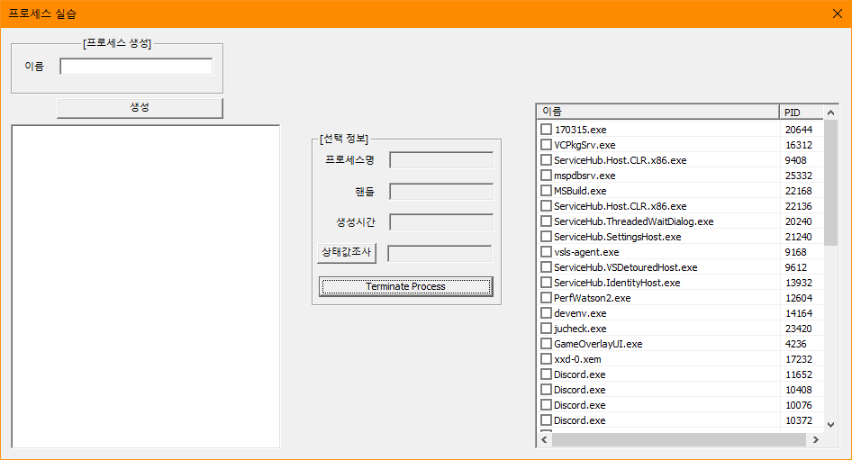
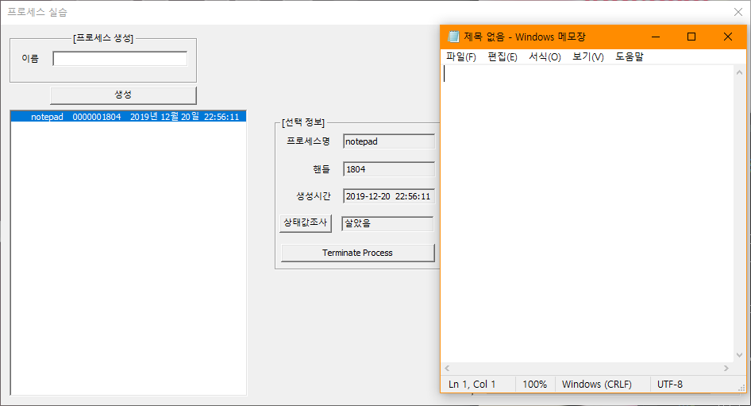

# BIT_EXPERT_WSP_ProcessManager
Windows System Programming : 프로세스를 다루는 API를 이용한 프로세스 관리 프로그램

## 개요
* 비트 고급과정 - Windows System Programming : 프로세스를 생성, 정보 획득, 종료하는 기능을 구현합니다.
* 실행하고자 하는 프로그램이름을 입력하여 '생성'버튼을 눌러 새로운 프로세스를 실행합니다.
* 새로 생성된 프로세스는 ListBox에 추가되며 ListBox 항목 선택시 [선택 정보] 그룹박스에 정보가 표시됩니다.
* ListBox에 추가된 프로세스를 선택하고 'Terminate Process'버튼 클릭 시 프로세스가 종료됩니다.

## 개발 기간
* 2017.03.15

## 기술 스택
* C++, Win32 API

## 개발 환경
* OS : Windows 8.1
* IDE : Visul Studio 2017

## 실행 화면
* 초기화면  

* 메모장 실행화면

## 실행 방법
1. 솔루션을 열고 'F7'을 눌러 빌드
2. Ctrl + F5를 눌러 빌드된 프로그램 실행
3. '프로세스 생성' 그룹박스의 이름에 프로그램 이름을 입력하고 '생성'버튼을 눌러 프로세스를 생성합니다.
4. ListBox컨트롤에 생성한 프로세스가 추가되고 프로그램이 켜졌는지 확인합니다. 그리고 ListBox에 추가된 항목을 선택합니다.
5. 선택한 프로세스 정보가 중앙 '선택 정보'그룹박스에 표시되는지 확인합니다.
6. '상태값조사'버튼을 눌러 현재 프로세스의 실행, 종료 여부를 판별합니다.
7. 'Terminate Process'버튼을 눌러 프로세스를 종료합니다.

## API 참조
* CreateProcess : <https://docs.microsoft.com/ko-kr/windows/win32/api/processthreadsapi/nf-processthreadsapi-createprocessw>
* CloseHandle : <https://docs.microsoft.com/ko-kr/windows/win32/api/handleapi/nf-handleapi-closehandle>
* EnumProcesses : <https://docs.microsoft.com/ko-kr/windows/win32/api/psapi/nf-psapi-enumprocesses>
* EnumProcessModules : <https://docs.microsoft.com/ko-kr/windows/win32/api/psapi/nf-psapi-enumprocessmodules>
* GetModuleBaseName : <https://docs.microsoft.com/ko-kr/windows/win32/api/psapi/nf-psapi-getmodulebasenamew>
* GetExitCodeProcess : <https://docs.microsoft.com/ko-kr/windows/win32/api/processthreadsapi/nf-processthreadsapi-getexitcodeprocess>
* OpenProcess : <https://docs.microsoft.com/ko-kr/windows/win32/api/processthreadsapi/nf-processthreadsapi-openprocess>
* TerminateProcess : <https://docs.microsoft.com/ko-kr/windows/win32/api/processthreadsapi/nf-processthreadsapi-terminateprocess>
