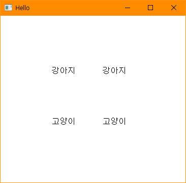
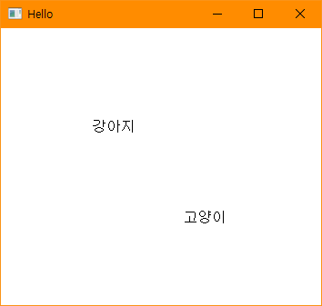

# BIT_EXPERT_WSP_ThreadSynchronize_Practice
Windows System Programming : 스레드간의 자원 공유기법인 임계영역을 생성하고 제어하는 실습

## 개요
* 비트 고급과정 - Windows System Programming : x좌표를 전역(공유) 변수로 두고 생성된 두개의 스레드에서 x에 특정 값을 대입하며 텍스트를 그리는 실습
* 윈도우 클라이언트 영역에서 마우스 왼쪽을 클릭하면 스레드1과 스레드2가 생성되고 실행됩니다.
* 스레드1은 전역변수 x에 100을 대입하고 (x,100) 좌표에 "강아지" 텍스트를 그립니다. 이를 100번 반복합니다.
* 스레드2은 전역변수 x에 200을 대입하고 (x,200) 좌표에 "고양이" 텍스트를 그립니다. 이를 100번 반복합니다.
* 스레드1과 스레드2는 실행순서를 예측하기 어렵기 때문에 동기화 기법를 사용하지 않으면 출력이 원하는대로 나오지 않습니다.

## 개발 기간
* 2017.03.20

## 기술 스택
* C++, Win32 API

## 개발 환경
* OS : Windows 8.1
* IDE : Visul Studio 2017

## 실행 화면
* 동기화를 사용하지 않은 화면  

* 동기화를 사용한 화면  

## 실행 방법
1. 솔루션을 열고 'F7'을 눌러 빌드
2. 빌드된 두 프로그램을 실행
3. 윈도우 클라이언트 영역에서 마우스 왼쪽 버튼을 눌러 스레드1과 스레드2를 생성하고 실행합니다.
4. 동기화를 사용하지 않은 프로그램에서는 (100,100), (200,200)이 아닌 위치에서도 텍스트가 출력됩니다.
5. 동기화를 사용한 프로그램에서는 (100,100), (200,200)위치에 정확히 텍스트가 출력됩니다.

## API 참조
* CreateThread : <https://docs.microsoft.com/ko-kr/windows/win32/api/processthreadsapi/nf-processthreadsapi-createthread>
* InitializeCriticalSection : <https://docs.microsoft.com/ko-kr/windows/win32/api/synchapi/nf-synchapi-initializecriticalsection>
* EnterCriticalSection : <https://docs.microsoft.com/ko-kr/windows/win32/api/synchapi/nf-synchapi-entercriticalsection>
* LeaveCriticalSection : <https://docs.microsoft.com/ko-kr/windows/win32/api/synchapi/nf-synchapi-leavecriticalsection>
* DeleteCriticalSection : <https://docs.microsoft.com/ko-kr/windows/win32/api/synchapi/nf-synchapi-deletecriticalsection>
