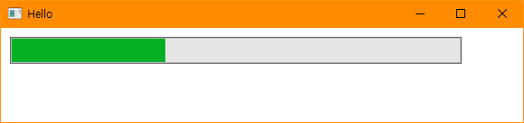
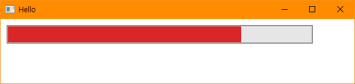

# BIT_EXPERT_WSP_Thread_Practice
Windows System Programming : Thread를 새로 생성하고 제어하는 실습

## 개요
* 비트 고급과정 - Windows System Programming : 진행바 컨트롤의 진행률을 제어하는 스레드를 만들어 일시중지 하거나 재개합니다.

## 개발 기간
* 2017.03.20

## 기술 스택
* C++, Win32 API

## 개발 환경
* OS : Windows 8.1
* IDE : Visul Studio 2017

## 실행 화면
* 스레드 동작상태 화면  

* 스레드 일시중지상태 화면  

## 실행 방법
1. 솔루션을 열고 'F7'을 눌러 빌드
2. Ctrl + F5를 눌러 디버깅하지않고 실행
3. 윈도우 클라이언트 영역에서 마우스 왼쪽 버튼을 눌러 스레드를 생성합니다.
4. 윈도우 클라이언트 영역에서 마우스 오른쪽 버튼을 눌러 스레드의 상태를 재개상태로 만듭니다.
5. 진행바의 진행률이 상승하는 도중에 윈도우 클라이언트 영역에서 마우스 오른쪽 버튼을 눌러 스레드의 상태를 일시중지 상태로 만듭니다.

## API 참조
* CreateThread : <https://docs.microsoft.com/ko-kr/windows/win32/api/processthreadsapi/nf-processthreadsapi-createthread>
* ResumeThread : <https://docs.microsoft.com/ko-kr/windows/win32/api/processthreadsapi/nf-processthreadsapi-resumethread>
* SuspendThread : <https://docs.microsoft.com/ko-kr/windows/win32/api/processthreadsapi/nf-processthreadsapi-suspendthread>
