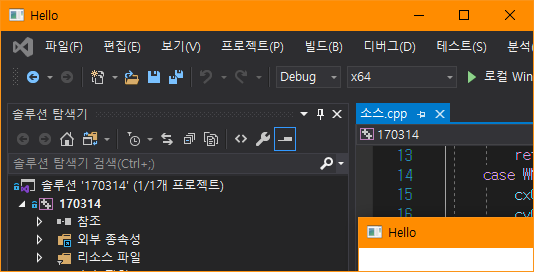
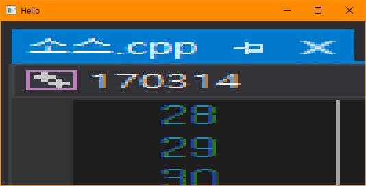

# BIT_EXPERT_Win32API_Bitmap_Practice
* Win32 API : 비트맵 컨트롤 API를 이용한 화면복제 프로그램

## 개요
* 비트 고급과정 - Win32 API : 비트맵을 복사하여 일부 화면을 윈도우에 확대하여 출력하거나 복사합니다.
* 클라이언트 영역 크기만큼 배경화면을 클라이언트 영역에 복사합니다.
* 마우스 좌표로부터 100*100 크기만큼 비트맵을 복사하여 클라이언트 영역에 늘려서 출력합니다.

## 개발 기간
* 2017.03.14

## 기술 스택
* C++, Win32 API

## 개발 환경
* OS : Windows 8.1
* IDE : Visul Studio 2017

## 실행 화면
* 배경화면 복사  

* 마우스 좌표로부터 100*100 크기만큼 복사하여 늘려 출력  

## 실행 방법
1. 솔루션을 열고 'F7'을 눌러 빌드
2. Ctrl + F5를 눌러 빌드된 프로그램 실행
3. 실행된 윈도우를 움직여 배경화면을 클라이언트 영역에 복사하는 것을 확인합니다.
4. 윈도우 클라이언트 영역에서 마우스를 클릭한 후 움직여서 마우스 좌표로부터 100*100크기만큼 복사하고 클라이언트 영역크기만큼 늘려 출력하는 것을 확인합니다.

### API 참조
* BitBlt : <https://docs.microsoft.com/ko-kr/windows/win32/api/wingdi/nf-wingdi-bitblt>
* StretchBit : <https://docs.microsoft.com/ko-kr/windows/win32/api/wingdi/nf-wingdi-stretchblt>
