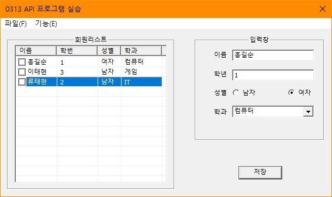
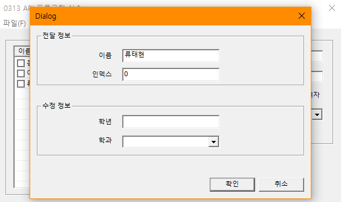

# BIT_EXPERT_Win32API_Dialog_Practice
* Win32 API의 대화상자 리소스를 이용한 회원관리 프로그램

## 개요
* 비트 고급과정 - Win32 API의 대화상자 리소스를 추가하여 대화상자에서 발생하는 메시지를 처리한다.
* 이번 실습에서는 대화상자를 최상위 부모 윈도우로 한다.
* 학년 EDIT 컨트롤은 숫자만 입력가능하도록 서브클래싱을 정의한다.
* 학생정보를 '입력창'그룹에서 작성하여 '저장'버튼을 누르면 '회원리스트'그룹의 리스트에 추가된다.

## 개발 기간
* 2017.03.13

## 기술 스택
* C++, Win32 API

## 개발 환경
* OS : Windows 8.1
* IDE : Visul Studio 2017

## 실행 화면
* 기본화면  

* 기능화면  

## 실행 방법
1. 솔루션을 열고 'F7'을 눌러 빌드
2. Ctrl + F5를 눌러 빌드된 프로그램 실행
3. '입력'그룹박스에 학생정보를 입력하고 '저장'버튼을 누릅니다.
4. '회원리스트'에 저장된 학생정보를 클릭하고 '기능(E)' - '검색(F)'를 클릭합니다.
5. 이전 대화상자에서 전달된 내용을 확인합니다.
6. '파일(F)' - 프로그램종료(X)'를 클릭하여 대화상자를 닫습니다.

### API 참조
* CallWindowProc : <https://docs.microsoft.com/ko-kr/windows/win32/api/winuser/nf-winuser-callwindowprocw>
* DialogBox : <https://docs.microsoft.com/ko-kr/windows/win32/api/winuser/nf-winuser-dialogboxw>
* DialogBoxParam : <https://docs.microsoft.com/ko-kr/windows/win32/api/winuser/nf-winuser-dialogboxparamw>
* SetWindowLong(32bit) : <https://docs.microsoft.com/ko-kr/windows/win32/api/winuser/nf-winuser-setwindowlongw>
* ListView_SetExtendedListViewStyle : <https://docs.microsoft.com/ko-kr/windows/win32/api/commctrl/nf-commctrl-listview_setextendedlistviewstyle>
