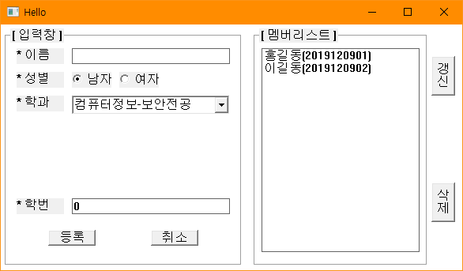

# BIT_EXPERT_Win32API_Dynamic_Control_Practice
* Win32 API - 동적으로 컨트롤 생성하여 메시지를 처리하는 예제

## 개요
* 비트 고급과정 - Win32 API에서 사용자와의 인터페이스를 위해 제공하는 컨트롤을 생성하여 컨트롤에서 메시지를 보내거나 컨트롤에 메시지를 보내는 것을 실습

## 개발 기간
* 2017.03.09

## 기술 스택
* C++, Win32 API

## 개발 환경
* OS : Windows 8.1
* IDE : Visul Studio 2017

## 실행 화면

## 실행 방법
1. 솔루션을 열고 'F7'을 눌러 빌드
2. Ctrl + F5를 눌러 빌드된 프로그램 실행
3. 입력창에 이름, 성별, 학과, 학번 입력 후 '등록'을 클릭하여 '멤버리스트'에 추가합니다.
4. '멤버리스트' 리스트에서 학생을 선택하여 입력창에 불러오는 것을 확인합니다.
5. '멤버리스트' 리스트에서 학생을 선택하여 '삭제'버튼을 눌러 리스트에서 제거합니다.
6. 클라이언트 영역에 마우스 왼쪽 버튼을 눌러 마지막에 등록했던 학생 정보를 표시합니다.

## API 참조
* CreateWindow : <https://docs.microsoft.com/ko-kr/windows/win32/api/winuser/nf-winuser-createwindoww>
* GetDlgItemInt : <https://docs.microsoft.com/ko-kr/windows/win32/api/winuser/nf-winuser-getdlgitemint>
* SetDlgItemInt : <https://docs.microsoft.com/ko-kr/windows/win32/api/winuser/nf-winuser-setdlgitemint>
* GetWindowText : <https://docs.microsoft.com/ko-kr/windows/win32/api/winuser/nf-winuser-getwindowtextw>
* SetWindowText : <https://docs.microsoft.com/ko-kr/windows/win32/api/winuser/nf-winuser-setwindowtextw>
* CheckRadioButton : <https://docs.microsoft.com/ko-kr/windows/win32/api/winuser/nf-winuser-checkradiobutton>
