# BIT_EXPERT_Win32API_HitTest_GDI_Practice
* HitTest, SystemMetric, SetROP2, Mapping, MouseCapture에 대한 실습

## 개요
* 비트 고급과정 - Win32 API HitTest, SystemMetric, SetROP2, Mapping, MouseCapture에 대한 실습

## 개발 기간
* 2017.03.08

## 기술 스택
* C++, Win32 API

## 개발 환경
* OS : Windows 8.1
* IDE : Visul Studio 2017

## 프로젝트 소개
* 다수의 프로젝트가 하나의 솔루션으로 구성되어있습니다. 각 프로젝트를 실행하려면 시작 프로젝트를 변경해야합니다.

### DrawSquare
* 마우스 왼쪽 버튼을 클릭하고 움직여 임의의 위치에서 놓으면 클라이언트 영역의 (10, 10)좌표에서 마우스 왼쪽버튼을 놓은 좌표 범위에 사각형을 그립니다.
* 마우스 왼쪽 버튼을 클릭하고 움직이는 동안에 미리 그려질 사각형을 그립니다.
* 마우스 왼쪽 버튼을 클릭한 시점에서 캡처가 시작되며 버튼을 놓으면 캡처가 종료됩니다. 때문에 마우스를 끌고 클라이언트 영역 바깥으로 나가더라도 프로그램에 그려질 사각형을 미리 그립니다.

### 실행 화면
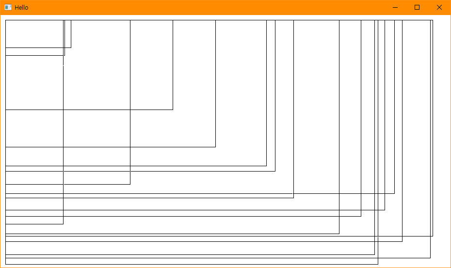

### 실행 방법
1. 솔루션을 열고 'F7'을 눌러 빌드
2. 'Ctrl + F5'를 눌러 실행
3. 클라이언트 영역에서 임의의 위치에서 마우스 왼쪽 버튼을 누르고 움직입니다. 이 때 그려질 사각형이 미리 그려지는 것을 확인합니다.
4. 마우스 왼쪽 버튼을 놓으면 클라이언트 영역 (10, 10)에서 놓은 좌표 범위내에 사각형이 그려집니다.

### API 참조
* SetCapture : <https://docs.microsoft.com/ko-kr/windows/win32/api/winuser/nf-winuser-setcapture>
* SetROP2 : <https://docs.microsoft.com/ko-kr/windows/win32/api/wingdi/nf-wingdi-setrop2>

***
### GetKeydown
* 윈도우 상단의 메뉴를 눌러 옵션 1 ~ 3을 선택하여 아래 옵션에 해당하는 기능을 구현합니다.
* 옵션 1 : 키보드의 버튼을 눌렀을 때 눌린 버튼의 스캔코드와 가상키코드를 메시지박스로 알립니다. 가상 키코드는 시스템에 장착된 키보드에 관계없이 키 입력을 받기 위해 사용됩니다.
* 옵션 2 : 방향키(상, 하, 좌, 우)를 눌러 '%' 텍스트를 옮깁니다.
* 옵션 3 : 'Ctrl + F1'을 눌러 메시지를 확인합니다. Ctrl키가 눌려있는지 여부를 확인하므로 그 외의 키를 눌렀을 때에는 어떤 메시지도 표시되지 않습니다.

### 실행 화면
* 옵션 1 : 'a'를 눌렀을 때 화면  
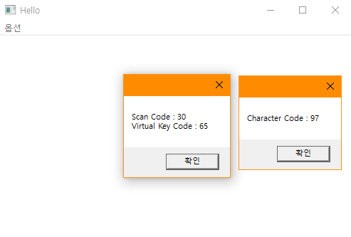

* 옵션 2 : '좌'키를 10번 '하'키를 5번 눌렀을 때 화면  
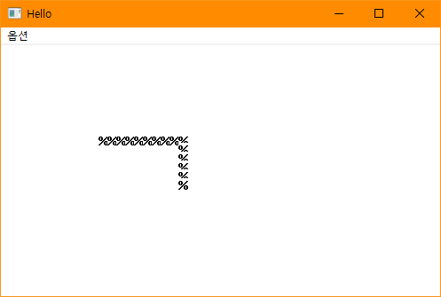

* 옵션 3 : 'Ctrl + F1'을 눌렀을 때 화면  
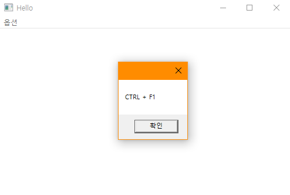

### 실행 방법
1. 솔루션을 열고 'F7'을 눌러 빌드
2. 'Ctrl + F5'를 눌러 실행
3. 윈도우 상단의 메뉴를 눌러 옵션 1 ~ 3중 하나를 선택합니다.
4. 위의 '실행 화면' 예시를 수행합니다.

### API 참조
* WM_CHAR : <https://docs.microsoft.com/ko-kr/windows/win32/inputdev/wm-char>
* WM_KEYDOWN : <https://docs.microsoft.com/ko-kr/windows/win32/inputdev/wm-keydown>
* Virtual-Key Codes : <https://docs.microsoft.com/ko-kr/windows/win32/inputdev/virtual-key-codes>
* GetKeyState : <https://docs.microsoft.com/ko-kr/windows/win32/api/winuser/nf-winuser-getkeystate>

***
### GetTimerInfo
* WM_TIMER 메시지에 의해 1초 마다 의해 캡션바 내용을 현재 시스템 시간으로 설정합니다.
* 특정 파일의 생성,수정,액세스 날짜를 획득하여 표시합니다. (Ctrl + 마우스 왼쪽 버튼)
* 타이머를 프로그램 수행중에 해제 할 수 있습니다. (Shift + 마우스 왼쪽 버튼)
* 운영체제 부팅 후의 시간을 획득하여 표시합니다. (Ctrl + 마우스 오른쪽 버튼)

### 실행 화면
* 기본 화면  

* 마우스 왼쪽버튼 눌렀을 때  
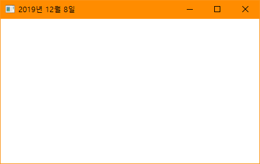

* Ctrl + 마우스 왼쪽버튼 눌렀을 때  
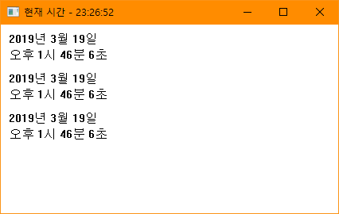

* 마우스 오른쪽 버튼 눌렀을 때  
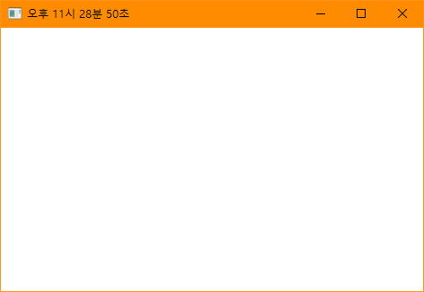

* Ctrl + 마우스 오른쪽 버튼 눌렀을 때  
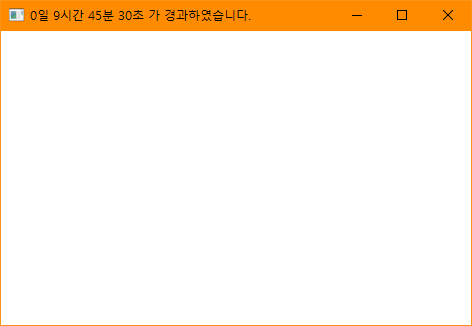

### 실행 방법
1. 솔루션을 열고 'F7'을 눌러 빌드
2. 'Ctrl + F5'를 눌러 실행
3. 클라이언트 영역에서 '실행 화면'에 소개한 상황을 따라해봅니다.
4. Shift + 마우스 왼쪽 버튼을 눌러 캡션바가 갱신되지 않는 것을 확인합니다.

### API 참조
* SetTimer : <https://docs.microsoft.com/ko-kr/windows/win32/api/winuser/nf-winuser-settimer>
* KillTimer : <https://docs.microsoft.com/ko-kr/windows/win32/api/winuser/nf-winuser-killtimer>
* WM_TIMER : <https://docs.microsoft.com/ko-kr/windows/win32/winmsg/wm-timer>
* GetTickCount : <https://docs.microsoft.com/ko-kr/windows/win32/api/sysinfoapi/nf-sysinfoapi-gettickcount>
* GetLocalTime : <https://docs.microsoft.com/ko-kr/windows/win32/api/sysinfoapi/nf-sysinfoapi-getlocaltime>
* GetSystemTime : <https://docs.microsoft.com/ko-kr/windows/win32/api/sysinfoapi/nf-sysinfoapi-getsystemtime>
* FileTimeToSystemTime : <https://docs.microsoft.com/ko-kr/windows/win32/api/timezoneapi/nf-timezoneapi-filetimetosystemtime>
* SystemTimeToTzSpecificLocalTime : <https://docs.microsoft.com/ko-kr/windows/win32/api/timezoneapi/nf-timezoneapi-systemtimetotzspecificlocaltime>
* GetDataFormat : <https://docs.microsoft.com/ko-kr/windows/win32/api/datetimeapi/nf-datetimeapi-getdateformatw>
* GetTimeFormat : <https://docs.microsoft.com/ko-kr/windows/win32/api/datetimeapi/nf-datetimeapi-gettimeformatw>
* GetFileTime : <https://docs.microsoft.com/ko-kr/windows/win32/api/fileapi/nf-fileapi-getfiletime>

***
### Mapping
* 기본 그리기 맵핑모드로 그리고 MM_LOMETRIC 맵핑을 적용하여 그려봅니다.
* 단위가 0.1mm인 MM_LOMETRIC을 적용하여 그린 Rectangle(hdc, 0, 0, 100, -100)는 실제 자를 데어 봤을 때 100mm(=1cm)길이를 가집니다.

### 실행 화면
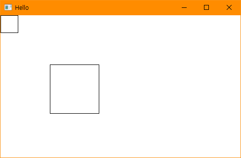

### 실행 방법
1. 솔루션을 열고 'F7'을 눌러 빌드
2. 'Ctrl + F5'를 눌러 실행
3. 기본맵핑인 MM_TEXT 맵핑을 사용한 (100, 100) ~ (200, 200)에 그려진 사각형과 MM_LOMETRIC 맵핑을 사용하여 (0, 0)에서 그려진 사각형을 비교해봅니다.

### API 참조
* SetMapMode : <https://docs.microsoft.com/ko-kr/windows/win32/api/wingdi/nf-wingdi-setmapmode>

***
### MenuTest
* 윈도우에서 메뉴등록, 삭제, 수정 등을 구현합니다.
* 마우스 오른쪽 버튼을 클릭했을 때 WM_CONTEXTMENU를 메시지 처리기에 전달합니다.

### 실행 화면
* 기본화면  
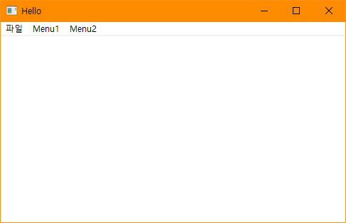

* 마우스 왼쪽 버튼을 3번 눌렀을 때 (추가메뉴 3개 생성 확인)  
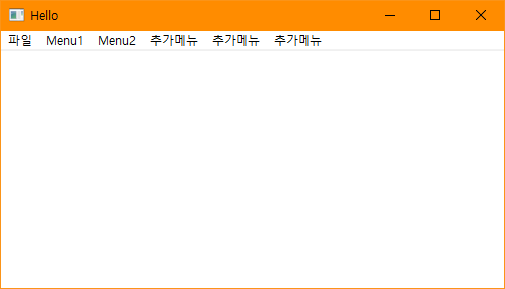

* 마우스 왼쪽 버튼을 3번 눌렀을 때 (첫번째 서브메뉴에 3개 하위메뉴 'BBB'와 세퍼레이터 생성 확인)  
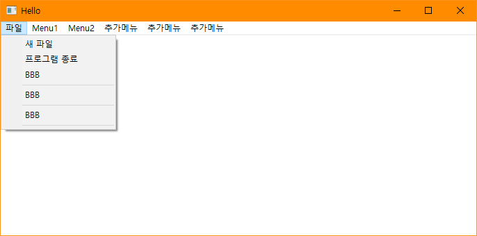

* Ctrl + 마우스 왼쪽 버튼을 눌렀을 때 (메뉴 제거)  
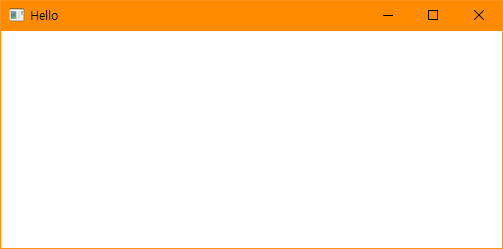

* 마우스 오른쪽 버튼을 눌렀을 때 (두번째 서브메뉴를 호출)  

### 실행 방법
1. 솔루션을 열고 'F7'을 눌러 빌드
2. 'Ctrl + F5'를 눌러 실행
3. 위 '실행 화면'예시를 따라해봅니다.

### API 참조
* SetMenu : <https://docs.microsoft.com/ko-kr/windows/win32/api/winuser/nf-winuser-setmenu>
* GetMenu : <https://docs.microsoft.com/ko-kr/windows/win32/api/winuser/nf-winuser-getmenu>
* LoadMenu : <https://docs.microsoft.com/ko-kr/windows/win32/api/winuser/nf-winuser-loadmenuw>
* GetSubMenu : <https://docs.microsoft.com/ko-kr/windows/win32/api/winuser/nf-winuser-getsubmenu>
* AppendMenu : <https://docs.microsoft.com/ko-kr/windows/win32/api/winuser/nf-winuser-appendmenuw>
* DeleteMenu : <https://docs.microsoft.com/ko-kr/windows/win32/api/winuser/nf-winuser-deletemenu>
* DrawMenuBar : <https://docs.microsoft.com/ko-kr/windows/win32/api/winuser/nf-winuser-drawmenubar>
* CreateMenuItem : <https://docs.microsoft.com/ko-kr/windows/win32/api/winuser/nf-winuser-checkmenuitem>
* EnableMenuItem : <https://docs.microsoft.com/ko-kr/windows/win32/api/winuser/nf-winuser-enablemenuitem>
* WM_CONTEXTMENU : <https://docs.microsoft.com/ko-kr/windows/win32/menurc/wm-contextmenu>

***
### MouseCapture
* 클라이언트 영역에서만 마우스를 움직일 때 캡션바에 마우스 좌표를 표시합니다. (클라이언트 영역 좌측 상단이 0,0 입니다.)
* 클라이언트 영역에서 마우스 왼쪽 버튼을 누른 상태에서 클라이언트 영역 밖으로 마우스를 움직일 때에도 마우스 좌표를 표시합니다.(마우스 캡처 사용)
* 마우스 왼쪽 버튼을 놓았을 때 커서에 있는 곳의 윈도우 핸들을 얻어 정보를 표시합니다.

### 실행 화면
* 클라이언트 영역에서 마우스를 움직였을 때  
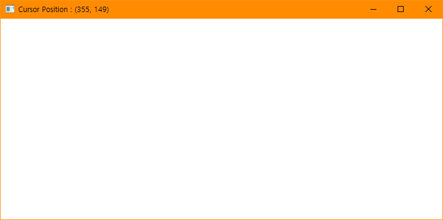

* 클라이언트 영역에서 마우스 왼쪽 버튼을 누르고 클라이언트 영역 바깥으로 나갔을 때 (좌표 음수 확인)  
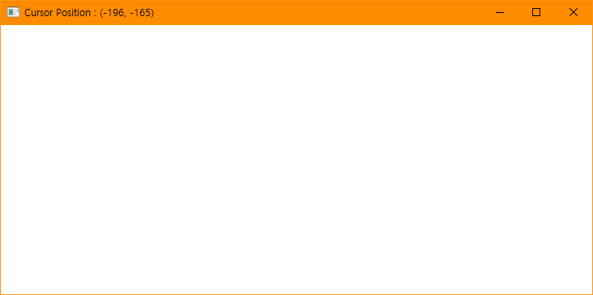

* 클라이언트 영역 바깥에서 마우스 왼쪽 버튼을 놓았을 때 (Chrome 창)  
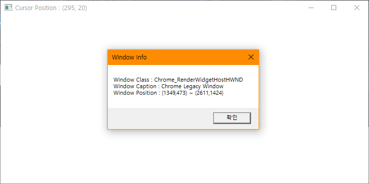

### 실행 방법
1. 솔루션을 열고 'F7'을 눌러 빌드
2. 'Ctrl + F5'를 눌러 실행
3. 클라이언트 영역에서 마우스를 움직이면서 캡션바를 확인합니다.
4. 클라이언트 영역에서 마우스 왼쪽 버튼을 누른상태에서 클라이언트 영역 바깥으로 나가면서 캡션바를 확인합니다.
5. 마우스 왼쪽 버튼을 놓아 커서 위치에 있는 핸들의 정보를 표시합니다.

### API 참조
* SetCapture : <https://docs.microsoft.com/ko-kr/windows/win32/api/winuser/nf-winuser-setcapture>
* GetCapture : <https://docs.microsoft.com/ko-kr/windows/win32/api/winuser/nf-winuser-getcapture>
* ReleaseCapture : <https://docs.microsoft.com/ko-kr/windows/win32/api/winuser/nf-winuser-releasecapture>
* GetCursorPos : <https://docs.microsoft.com/ko-kr/windows/win32/api/winuser/nf-winuser-getcursorpos>
* WindowFromPoint : <https://docs.microsoft.com/ko-kr/windows/win32/api/winuser/nf-winuser-windowfrompoint>
* GetClassName : <https://docs.microsoft.com/ko-kr/windows/win32/api/winuser/nf-winuser-getclassnamew>
* GetWindowText : <https://docs.microsoft.com/ko-kr/windows/win32/api/winuser/nf-winuser-getwindowtextw>
* GetWindowRect : <https://docs.microsoft.com/ko-kr/windows/win32/api/winuser/nf-winuser-getwindowrect>

***
### MouseInfo
* Ctrl + 마우스 왼쪽 버튼을 눌러 클라이언트 좌표, 스크린 좌표를 표시합니다.
* Shift + 마우스 왼쪽 버튼을 눌러 클라이언트 좌표를 SHORT 타입과 LONG타입의 좌표로 표시합니다.
* Ctrl + 마우스 오른쪽 버튼을 눌러 메시지를 표시합니다.
* Shift + 마우스 오른쪽 버튼을 눌러 메시지를 표시합니다.
* Ctrl + Shift를 누른상태에서 마우스 왼쪽 버튼을 눌러 움직이면 왼쪽 테두리를 잡고 움직이는 것처럼 동작합니다.
* 창의 오른쪽 테두리를 잡아 끌면 창의 왼쪽 테두리를 잡아 끄는것으로 동작합니다.

### 실행 화면
* Ctrl + 마우스 왼쪽 버튼을 눌렀을 때  
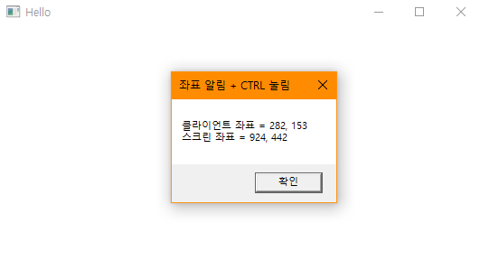

* Shift + 마우스 왼쪽 버튼을 눌렀을 때  
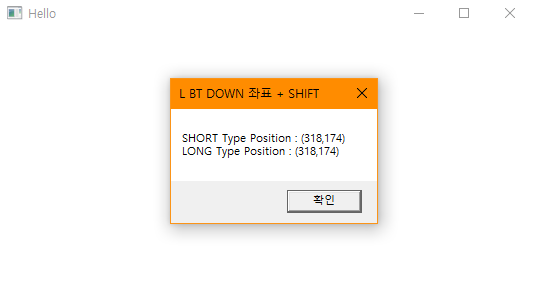

* Ctrl + 마우스 오른쪽 버튼을 눌렀을 때  
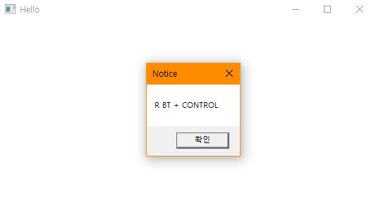

* Shift + 마우스 오른쪽 버튼을 눌렀을 때  
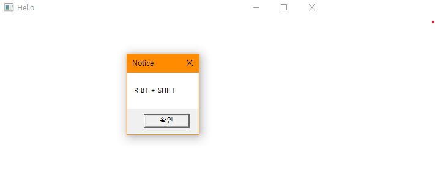

### 실행 방법
1. 솔루션을 열고 'F7'을 눌러 빌드
2. 'Ctrl + F5'를 눌러 실행
3. 위 '실행 화면'예시를 따라해봅니다.

### API 참조
* ClientToScreen : <https://docs.microsoft.com/ko-kr/windows/win32/api/winuser/nf-winuser-clienttoscreen>
* WM_NCHITTEST : <https://docs.microsoft.com/ko-kr/windows/win32/inputdev/wm-nchittest>

***
### SetROP2Test
* ROP2를 적용하여 현재 클라이언트 영역에 그려진 색상과 어떻게 결합될 것인지 결정합니다.
* Test1에서 사용된 모드는 NOTXORPEN이며 사각형 1너비씩 늘려가며 순차적 5개까지 덮어씌웁니다.
* NOTXORPEN으로 같은곳에 두번 그려지게되면 첫번째 그림이 지워지는 특징이 있습니다.

### 실행 화면
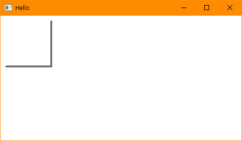

### 실행 방법
1. 솔루션을 열고 'F7'을 눌러 빌드
2. 'Ctrl + F5'를 눌러 실행

### API 참조
* SetROP2 : <https://docs.microsoft.com/ko-kr/windows/win32/api/wingdi/nf-wingdi-setrop2>
* Rectangle : <https://docs.microsoft.com/ko-kr/windows/win32/api/wingdi/nf-wingdi-rectangle>

***
### SetROP2Test2
* ROP2를 적용하여 현재 클라이언트 영역에 그려진 색상과 어떻게 결합될 것인지 결정합니다.
* Test2에서 사용된 모드는 NOT이며 선을 2번 중복하여 그리고 마지막에 대각선을 그립니다.
* NOT으로 같은곳에 두번 그려지게되면 첫번째 그림이 지워지는 특징이 있습니다.(단, 이는 흑백환경에서 보장됩니다.)

### 실행 화면
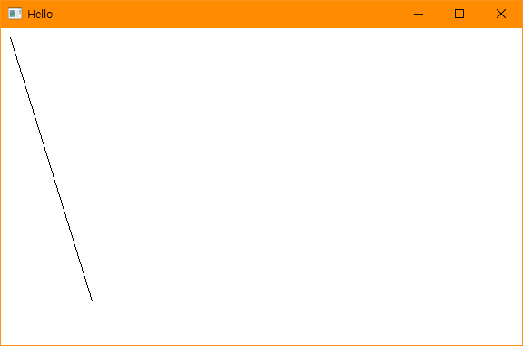

### 실행 방법
1. 솔루션을 열고 'F7'을 눌러 빌드
2. 'Ctrl + F5'를 눌러 실행

### API 참조
* SetROP2 : <https://docs.microsoft.com/ko-kr/windows/win32/api/wingdi/nf-wingdi-setrop2>
* MoveToEx : <https://docs.microsoft.com/ko-kr/windows/win32/api/wingdi/nf-wingdi-movetoex>
* LineTo : <https://docs.microsoft.com/ko-kr/windows/win32/api/wingdi/nf-wingdi-lineto>

***
### SetROP2Test3
* ROP2를 적용하여 현재 클라이언트 영역에 그려진 색상과 어떻게 결합될 것인지 결정합니다.
* Test3에서는 캡처모드를 사용하여 마우스 왼쪽 버튼을 누른 상태에서 클라이언트 영역 바깥으로 나간 것을 인식합니다.
* 마우스 왼쪽 버튼을 누른 지점부터 마우스를 움직일 때마다 그려질 선을 미리 그립니다.
* 마우스 왼쪽 버튼을 놓으면 누른 좌표와 놓은 좌표 사이에 선을 그립니다.

### 실행 화면
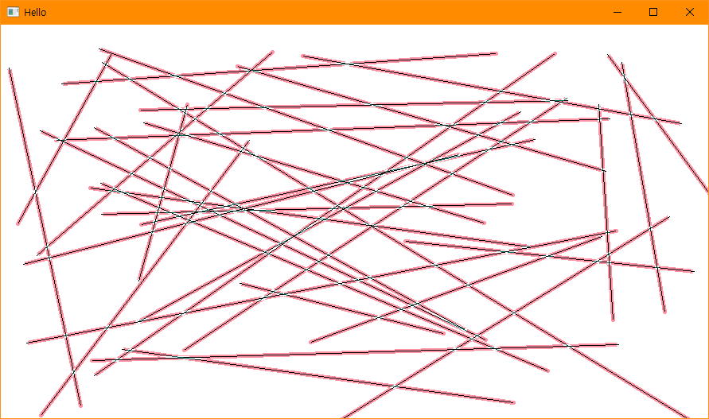

### 실행 방법
1. 솔루션을 열고 'F7'을 눌러 빌드
2. 'Ctrl + F5'를 눌러 실행
3. 클라이언트 영역에서 마우스 왼쪽 버튼을 누르고 마우스를 움직이며 선이 다시그려지는 것을 확인합니다.
4. 어느 위치에서든 마우스 왼쪽 버튼을 놓아 누른 좌표와 놓은 좌표사이에 선이 그려지는 것을 확인합니다.

### API 참조
* SetROP2 : <https://docs.microsoft.com/ko-kr/windows/win32/api/wingdi/nf-wingdi-setrop2>
* MoveToEx : <https://docs.microsoft.com/ko-kr/windows/win32/api/wingdi/nf-wingdi-movetoex>
* LineTo : <https://docs.microsoft.com/ko-kr/windows/win32/api/wingdi/nf-wingdi-lineto>
* SetCapture : <https://docs.microsoft.com/ko-kr/windows/win32/api/winuser/nf-winuser-setcapture>
* GetCapture : <https://docs.microsoft.com/ko-kr/windows/win32/api/winuser/nf-winuser-getcapture>
* ReleaseCapture : <https://docs.microsoft.com/ko-kr/windows/win32/api/winuser/nf-winuser-releasecapture>

***
### SystemMetric
* GetSystemMetric함수를 통해 시스템 구성 설정을 검색할 수 있습니다.
* 이 예제 에서는 마우스 정보와 해상도를 표시합니다.

### 실행 화면
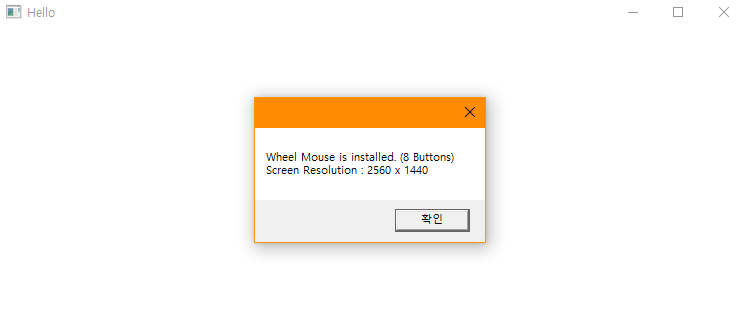

### 실행 방법
1. 솔루션을 열고 'F7'을 눌러 빌드
2. 'Ctrl + F5'를 눌러 실행
3. 클라이언트 영역에서 마우스 왼쪽 버튼을 눌러 마우스 정보와 해상도를 표시합니다.

### API 참조
* GetSystemMetrics : <https://docs.microsoft.com/ko-kr/windows/win32/api/winuser/nf-winuser-getsystemmetrics>