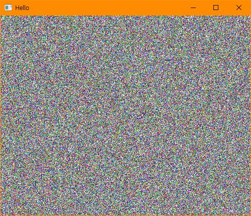

# BIT_EXPERT_Win32API_Message&DC_Practice
* Win32 API 메시지 프로시저와 장치 컨텍스트 핸들을 이용한 출력 실습

## 개요
* Win32 API에 사용자 정의 메시지를 전송해보거나, 장치 컨텍스트를 이용해 클라이언트 영역에 다양하게 출력합니다.

## 개발 목적
* 비트 고급과정 - Win32 API 메시지 프로시저, 장치 컨텍스트(DC) 핸들 실습

## 개발 기간
* 2017.03.07

## 기술 스택
* C++, Win32 API

## 개발 환경
* OS : Windows 8.1
* IDE : Visul Studio 2017

## 프로젝트 소개
* 다수의 프로젝트가 하나의 솔루션으로 구성되어있습니다. 각 프로젝트를 실행하려면 시작 프로젝트를 변경해야합니다.

### GDIObject
* 창을 그리는데 사용하는 WM_PAINT 메시지를 이용하여 사각형과 원을 그려냅니다.
* 각 도형은 Brush와 Pen의 DC를 획득하여 그려냅니다.
* PS_DASH, PS_DOT, PS_DASHDOT, PS_DASHDOTDOT 펜 스타일의 경우 Width를 1보다 크게 설정하면 PS_SOLID를 반환합니다.

### 실행 화면

### 실행 방법
1. 솔루션을 열고 'F7'을 눌러 빌드
2. 'Ctrl + F5'를 눌러 실행

### API 참조
* WM_PAINT : <https://docs.microsoft.com/ko-kr/windows/win32/gdi/the-wm-paint-message>
* CreatePen : <https://docs.microsoft.com/en-us/windows/win32/api/wingdi/nf-wingdi-createpen>
* SelectObject : <https://docs.microsoft.com/ko-kr/windows/win32/api/wingdi/nf-wingdi-selectobject>

***
### GetDCcpp
* 윈도우 핸들을 이용해서 DC를 가져오는 GetDC를 이용해 해당 윈도우 핸들을 소유한 창에 사각형을 그려냅니다.
* GetDC를 이용해 DC를 가져온 경우 ReleaseDC를 이용해 DC를 해제해야합니다.
* WM_PAINT가 발생하여 무효화영역이 발생하면 GetDC를 가져와 그린 내용들은 지워집니다.

### 실행 화면

### 실행 방법
1. 솔루션을 열고 'F7'을 눌러 빌드
2. 'Ctrl + F5'를 눌러 실행
3. 윈도우 클라이언트 영역에 마우스 왼쪽 버튼을 클릭하여 사각형 그리기
4. 윈도우 클라이언트 영역에 마우스 오른쪽 버튼을 클릭하여 특정영역에 무효화영역을 발생시켜 지우기

### API 참조
* GetDC : <https://docs.microsoft.com/ko-kr/windows/win32/api/winuser/nf-winuser-getdc>
* ReleaseDC : <https://docs.microsoft.com/ko-kr/windows/win32/api/winuser/nf-winuser-releasedc>

***
### MoveToLineTo
* MoveToEx, LineTo을 이용해 마우스 클릭한 상태로 마우스 움직임에 따라 왼쪽 버튼이면 선을 그리고 오른쪽 버튼이면 윈도우 배경색과 같은 색을 그려 지우는 효과를 냅니다.
* 선은 매번 임의의 색을 갖습니다.

### 실행 화면

### 실행 방법
1. 솔루션을 열고 'F7'을 눌러 빌드
2. 'Ctrl + F5'를 눌러 실행
3. 윈도우 클라이언트 영역에 마우스 왼쪽 버튼을 누른 상태로 마우스를 움직이며 선을 그립니다.
4. 마우스 오른쪽 버튼을 누른 상태로 마우스를 움직여 그린 선들을 흰색으로 덮어 씌웁니다.

### API 참조
* MAKEPOINTS : <https://docs.microsoft.com/ko-kr/windows/win32/api/wingdi/nf-wingdi-makepoints>
* MoveToEx : <https://docs.microsoft.com/ko-kr/windows/win32/api/wingdi/nf-wingdi-movetoex>
* LineTo : <https://docs.microsoft.com/ko-kr/windows/win32/api/wingdi/nf-wingdi-lineto>

***
### GetUserMessage, SendMessage
* ※ 프로젝트 2개를 이용합니다.
* 사용자 메시지를 정의하고 처리기를 생성하고 사용자 메시지를 보냅니다.
* 마우스 클릭 메시지를 이용하여 계산기창의 핸들을 얻고 창을 컨트롤 합니다.
* 윈도우 프로시저에 직접 송신하는 SendMessage와 메시지 큐에 등록하는 PostMessage를 이용합니다.
* SendMessage는 호출 시 블록되며, PostMessage는 호출 시 블록되지 않고 바로 반환된다.

### 실행 화면

### 실행 방법
1. 솔루션을 열고 'F7'을 눌러 빌드
2. 빌드된 GetUserMessage.exe를 먼저 실행한 후, SendMessage.exe를 실행합니다.
3. GetUserMessage.exe쪽에서 메시지가 발생하는지 확인합니다.
3. 계산기를 켭니다.
4. GetUserMessage.exe창 클라이언트 영역에서 마우스 왼쪽 버튼을 눌러 계산기의 핸들을 표시합니다.
4. GetUserMessage.exe창 클라이언트 영역에서 마우스 오른쪽 버튼을 눌러 계산기를 특정좌표로 이동시킵니다.

### API 참조
* FindWindow : <https://docs.microsoft.com/ko-kr/windows/win32/api/winuser/nf-winuser-findwindoww>
* MoveWindow : <https://docs.microsoft.com/ko-kr/windows/win32/api/winuser/nf-winuser-movewindow>
* SendMessage : <https://docs.microsoft.com/ko-kr/windows/win32/api/winuser/nf-winuser-sendmessage>
* PostMessage : <https://docs.microsoft.com/ko-kr/windows/win32/api/winuser/nf-winuser-postmessagew>

***
### PaintAndInvalidate
* 마우스 왼쪽 버튼을 눌렀을 때 마우스의 현재 좌표를 캡션바로 설정하며 좌표 정보를 벡터 템플릿에 보관합니다.
* 마우스 왼쪽 버튼을 눌러 원을 그리고 무효화영역이 발생했을 때에도 그렸던 원들을 유지하게 합니다.

### 실행 화면

### 실행 방법
1. 솔루션을 열고 'F7'을 눌러 빌드
2. 'Ctrl + F5'를 눌러 실행
3. 클라이언트 영역에 마우스를 클릭하여 원을 그립니다.
4. 윈도우 클라이언트 영역을 다시 그려야할 때 마다 좌표 정보가 벡터에 저장되어있기 때문에 지속적으로 원을 다시 그립니다.

### API 참조
* BeginPaint : <https://docs.microsoft.com/ko-kr/windows/win32/api/winuser/nf-winuser-beginpaint>
* EndPaint : <https://docs.microsoft.com/ko-kr/windows/win32/api/winuser/nf-winuser-endpaint>
* InvalidateRect : <https://docs.microsoft.com/ko-kr/windows/win32/api/winuser/nf-winuser-invalidaterect>

***
### PeekMessage
* PeekMessage는 메시지 큐에 메시지가 남아있거나 없거나 다음 구문을 수행합니다.
* 메시지가 있다면 해당 메시지를 처리합니다. 메시지가 WM_QUIT 일 때 메시지 루프를 종료하여 프로그램을 종료합니다.
* 윈도우 클라이언트 영역에 마우스 왼쪽 버튼을 클릭하여 WM_CLOSE 메시지를 보내 프로그램 종료 요청을 보냅니다.

### 실행 화면
* 지속적으로 임의의 픽셀에 임의의 색상을 입혀서 만들어진 화면

### 실행 방법
1. 솔루션을 열고 'F7'을 눌러 빌드
2. 'Ctrl + F5'를 눌러 실행
3. 메시지 큐가 비어있을 때 랜덤한 픽셀에 임의의 색상으로 바꾸는 상태를 봅니다.
4. 윈도우 클라이언트 영역에 마우스 왼쪽 버튼을 클릭하여 WM_CLOSE 메시지를 보냅니다.

### API 참조
* PeekMessage : <https://docs.microsoft.com/ko-kr/windows/win32/api/winuser/nf-winuser-peekmessagew>
* SetPixel : <https://docs.microsoft.com/ko-kr/windows/win32/api/wingdi/nf-wingdi-setpixel>

***
### SinCurvedLine
* POINT 배열을 이용하여 선을 잇는 Polyline을 이용하여 y=sin(x) 그래프를 그립니다.

### 실행 화면

### 실행 방법
1. 솔루션을 열고 'F7'을 눌러 빌드
2. 'Ctrl + F5'를 눌러 실행

### API 참조
* Polyline : <https://docs.microsoft.com/ko-kr/windows/win32/api/wingdi/nf-wingdi-polyline>

***
### TextOut
* 지정된 사각형에 서식있는 텍스트를 그리는 DrawText를 이용하여 문자열을 그립니다.
* 지정된 좌표에 문자열을 그리는 TextOut을 사용하여 문자열을 그립니다.

### 실행 화면

### 실행 방법
1. 솔루션을 열고 'F7'을 눌러 빌드
2. 'Ctrl + F5'를 눌러 실행

### API 참조
* DrawText : <https://docs.microsoft.com/ko-kr/windows/win32/api/winuser/nf-winuser-drawtext>
* TextOut : <https://docs.microsoft.com/ko-kr/windows/win32/api/wingdi/nf-wingdi-textoutw>
