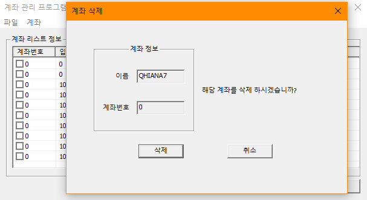

# BIT_EXPERT_Win32API_ModelessDialog_Practice
* Win32 API : 모달리스 대화상자를 이용한 계좌관리 프로그램

## 개요
* 비트 고급과정 - Win32 API : CreateDialogParam을 이용하여 모달리스 대화상자를 만들고 모달리스 대화상자에서 발생하는 메시지를 처리한다.
* 계좌 개설, 삭제하는 대화상자는 모달, 입출금을 기능은 모달리스 대화상자로 구현한다.
* 계좌는 1개만 생성되도록 하며 입출금 대화상자에서 기능사용시 부모 대화상자에서 실시간으로 반영되도록 한다.
* 계좌삭제는 모든 입출금내역을 삭제한다.

## 개발 기간
* 2017.03.13

## 기술 스택
* C++, Win32 API

## 개발 환경
* OS : Windows 8.1
* IDE : Visul Studio 2017

## 실행 화면
* 계좌개설 화면  

* 입출금 화면  

* 계좌삭제 화면  

## 실행 방법
1. 솔루션을 열고 'F7'을 눌러 빌드
2. Ctrl + F5를 눌러 빌드된 프로그램 실행
3. '계좌'-'계좌 입력'메뉴 클릭하고 대화상자를 열어 계좌번호와 이름을 입력하고 '개설'버튼을 누릅니다.
4. 우측 하단 '입/출금'버튼을 눌러 입금이나 출금 기능을 수행합니다.
5. '계좌 리스트' 정보에서 입출금 내역이 표시되는지 확인합니다.
6. '계좌'-'계좌 삭제'메뉴 클릭하고 대화상자를 열어 계좌번호와 이름을 입력하고 '삭제'버튼을 누릅니다.
7. '종료'버튼을 눌러 프로그램을 종료합니다.

### API 참조
* CallWindowProc : <https://docs.microsoft.com/ko-kr/windows/win32/api/winuser/nf-winuser-callwindowprocw>
* DialogBox : <https://docs.microsoft.com/ko-kr/windows/win32/api/winuser/nf-winuser-dialogboxw>
* DialogBoxParam : <https://docs.microsoft.com/ko-kr/windows/win32/api/winuser/nf-winuser-dialogboxparamw>
* CreateDialogParam : <https://docs.microsoft.com/ko-kr/windows/win32/api/winuser/nf-winuser-createdialogparamw>
* ListView_SetExtendedListViewStyle : <https://docs.microsoft.com/ko-kr/windows/win32/api/commctrl/nf-commctrl-listview_setextendedlistviewstyle>
