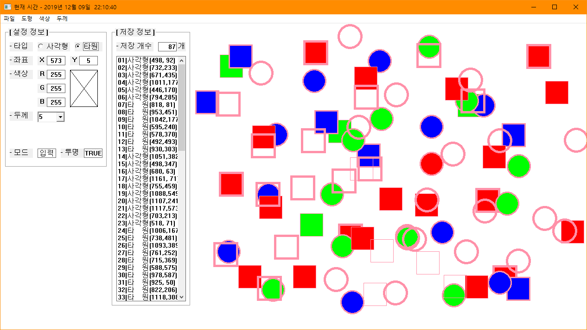

# BIT_EXPERT_Win32API_Shape_Painter
* Win32 API - 도형 그림판

## 개요
* 비트 고급과정 - Win32 API 최종과제
* 지금까지 Win32 API과정에서 배운 내용을 응용하여 그림판을 만들어 볼 수 있다.
* 임의의 좌표에 임의의 색상으로 1,3,5 중 하나의 두께를 가진 사각형 또는 타원을 그립니다.
* 설정 정보에서 선택하는 옵션은 메뉴에서도 가능합니다.
* 타이머 기능을 이용해 캡션바에 1초마다 현재 시간을 표시합니다.
* 지금까지 그린 도형들을 리스트 컨트롤에 표시하며 몇개의 도형이 저장되었는지 표시합니다.
* 리스트에서 그려진 도형을 하나 선택하여 설정 정보를 수정하면 실시간으로 반영됩니다.

## 개발 기간
* 2017.03.09

## 기술 스택
* C++, Win32 API

## 개발 환경
* OS : Windows 8.1
* IDE : Visul Studio 2017

## 실행 화면

## 실행 방법
1. 솔루션을 열고 'F7'을 눌러 빌드
2. Ctrl + F5를 눌러 빌드된 프로그램 실행
3. 클라이언트 영역에서 마우스를 움직이면 '설정 정보' 그룹박스 내의 좌표 영역에 현재 마우스 좌표가 업데이트 되는 것을 확인합니다.
4. '설정 정보' 그룹에서 그릴 도형의 옵션을 선택하고 우측 영역 임의의 위치에 마우스 왼쪽 버튼을 클릭하여 그립니다.
5. '색상'메뉴에서 '투명'을 선택하면 투명한 도형을 그릴 수 있습니다.
5. 그린 도형 정보가 '저장 정보' 그룹의 리스트에 저장되는 것을 확인합니다.
6. '저장 정보' 그룹의 리스트에 저장된 도형 정보중에 하나를 선택하면 '입력'모드에서 '수정'모드로 변경됩니다.
7. '수정'모드에서 '설정 정보' 그룹의 옵션을 바꾸면 '저장 정보'그룹의 리스트에서 선택했던 도형이 실시간으로 바뀝니다.
8. '파일'메뉴에서 '새 파일'을 누르면 모든 도형을 지우고 초기화면으로 설정합니다.
9. '파일'메뉴에서 '프로그램 종료'를 누르면 창을 닫습니다.

### API 참조
* CreateWindow : <https://docs.microsoft.com/ko-kr/windows/win32/api/winuser/nf-winuser-createwindoww>
* CreateSolidBrush : <https://docs.microsoft.com/ko-kr/windows/win32/api/wingdi/nf-wingdi-createsolidbrush>
* InvalidateRect : <https://docs.microsoft.com/ko-kr/windows/win32/api/winuser/nf-winuser-invalidaterect>
