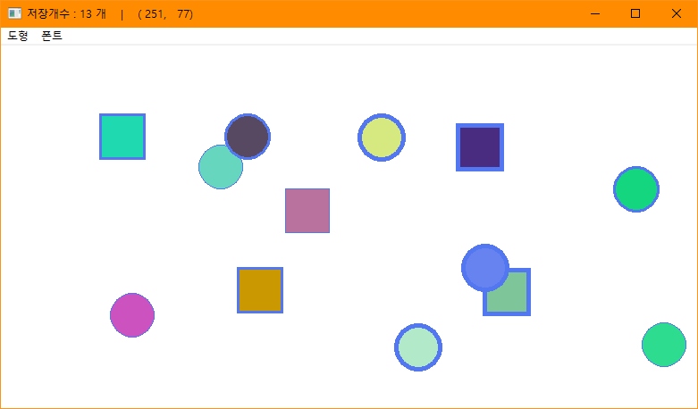
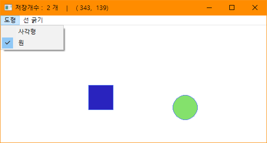

# BIT_EXPERT_Win32API_WM_PAINT_Practice
* WM_PAINT메시지와 POINT구조체를 활용한 도형 그리기 실습

## 개요
* 항상 그려져야하는 내용을 어떻게 구현해야 하는지 그에 필요한 데이터는 어떻게 저장되는지를 살펴봅니다.
* 윈도우에 메뉴 리소스를 추가하여 도형의 옵션을 지정할 수 있다.
* 마우스 왼쪽버튼을 클릭하면 그 위치에 지정된 옵션 스타일을 가진 도형에 임의의 색을 입혀 그립니다.
* Ctrl을 누른상태로 그리면 마지막에 그린 도형이 순서대로 없어진다.

## 개발 목적
* 비트 고급과정 - Win32 API WM_PAINT메시지 처리 및 메뉴 리소스 사용

## 개발 기간
* 2017.03.08

## 기술 스택
* C++, Win32 API

## 개발 환경
* OS : Windows 8.1
* IDE : Visul Studio 2017

## 실행 화면
* 임의의 위치에 그린 예시

* '도형' 서브메뉴 화면  

## 실행 방법
1. 솔루션을 열고 'F7'을 눌러 빌드
2. Ctrl + F5를 눌러 빌드된 프로그램 실행
3. 윈도우 클라이언트 영역 임의의 위치에 마우스 왼쪽 버튼을 눌러 도형이 그려지는 것을 확인
4. 윈도우 상단 메뉴를 이용하여 스타일 부여하여 도형 그려보기

### 단축키 일람
* '1' : 선 굵기를 1로 조정
* '3' : 선 굵기를 3로 조정
* '5' : 선 굵기를 5로 조정
* 'R' : 다음에 그려질 도형을 사각형으로 변경
* 'E' : 다음에 그려질 도형을 원으로 변경
* 'F1' : 모든 도형 지우기

## API 참조
* WM_PAINT : <https://docs.microsoft.com/ko-kr/windows/win32/gdi/the-wm-paint-message>
* GetWindowsRect :<https://docs.microsoft.com/ko-kr/windows/win32/api/winuser/nf-winuser-getwindowrect>
* CheckMenuItem : <https://docs.microsoft.com/ko-kr/windows/win32/api/winuser/nf-winuser-checkmenuitem>
* MAKEWPARAM : <https://docs.microsoft.com/ko-kr/windows/win32/api/winuser/nf-winuser-makewparam>
